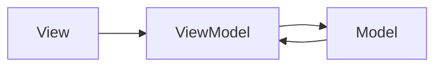

# MyGoodDiary

Proyecto de aplicación multiplataforma desarrollado con **.NET MAUI**.  
Permite llevar un diario personal con sincronización local y funcionalidades básicas de gestión de entradas.

## Requisitos

- [.NET 10 SDK](https://dotnet.microsoft.com/download/dotnet/10.0)
- IDE recomendado: Visual Studio Code con soporte para MAUI
- Android SDK y emuladores configurados si se quiere probar en Android
- (Opcional) Mac con Xcode si se desea compilar para iOS

## Comandos esenciales de MAUI

### Crear un proyecto MAUI
```bash
- dotnet new maui -n MyGoodDiary

- dotnet restore(Restaurar dependencias)

- dotnet build(Compilar la aplicación)

- dotnet build -t:Run -f net10.0-android(Ejecutar la aplicación en Android)

- dotnet build -t:Run -f net10.0-windows10.0.22621.0(Ejecutar la aplicación en Windows)

- dotnet clean(Limpiar la solución)
```

- Actualizar paquetes NuGet
```bash
dotnet nuget locals all --clear
dotnet restore
```

- Ejecutar Hot Reload en Android
```bash
dotnet watch -f net10.0-android run (Depuración rápida y Hot Reload(Hot Reload permite ver cambios en la UI sin reiniciar la app.))
```
- Ejecutar Hot Reload en Windows
```bash
dotnet watch -f net10.0-windows10.0.22621.0 run
```

###

```bash
- dotnet watch --no-launch-profile run(Reiniciar la app mientras se mantiene el estado)


- adb logcat -s MyGoodDiary:V(Ver logs en Android)
```


## Emuladores y dispositivos
Android: AVD Manager para crear emuladores, o conectar dispositivo con USB + depuración activada.
iOS: Simulador Xcode (Cmd + Shift + H para reset), o dispositivo conectado con provisionamiento correcto.

- Comando rápido para ver dispositivos Android conectados:

```bash
adb devices

```
- Comando rápido para ver simuladores iOS:

```bash

xcrun simctl list devices
```

### Recursos útiles
- Documentación oficial MAUI: https://learn.microsoft.com/dotnet/maui/
- Tutoriales y ejemplos: https://github.com/dotnet/maui-samples
- Tips de depuración y Hot Reload: https://learn.microsoft.com/dotnet/maui/debug


# 📔 MyGoodDiary

Aplicación basada en arquitectura **MVVM** diseñada para una gestión estructurada, escalable y mantenible.

---

## 🚀 Overview

MyGoodDiary sigue buenas prácticas modernas de desarrollo:

- Escalabilidad 📈  
- Mantenibilidad 🔧  
- Testeo 🧪  

---

## 🏗️ Arquitectura

Patrón **MVVM (Model-View-ViewModel)**:



- **Model** → Datos y lógica de negocio  
- **View** → Interfaz de usuario  
- **ViewModel** → Lógica de presentación  

---

## 📁 Estructura del Proyecto

```text
MyGoodDiary/
│
├── Platforms/        # Configuraciones específicas de cada plataforma
├── Resources/        # Imágenes, fuentes, estilos globales
├── Views/            # Páginas y layouts (UI)
├── ViewModels/       # Lógica de presentación
├── Models/           # Modelos de datos
├── App.xaml          # Configuración global de la aplicación
└── MainPage.xaml     # Página principal
```

---

## 🧩 Descripción de Componentes

| Elemento         | Responsabilidad |
|-----------------|----------------|
| `Platforms/`     | Configuración específica (Android, iOS, etc.) |
| `Resources/`     | Assets visuales y estilos reutilizables |
| `Views/`         | Interfaces de usuario |
| `ViewModels/`    | Estado y lógica de presentación |
| `Models/`        | Datos y entidades |
| `App.xaml`       | Inicialización global |
| `MainPage.xaml`  | Punto de entrada visual |

---

## ⚙️ Buenas Prácticas

- ✅ Separación de responsabilidades  
- ✅ MVVM limpio (sin lógica en UI)  
- ✅ Reutilización de recursos  
- ✅ Estructura preparada para escalar  

---

## 🧠 Convenciones

- `Views` ↔ `ViewModels` → relación 1:1  
- Evitar lógica en code-behind  
- `Models` simples (POCOs)  

---

## 📌 Notas Técnicas

- Preparado para proyectos medianos/grandes  
- Fácil integración con testing y DI  
- Arquitectura extensible  

---

## ✨ Futuras Mejoras

- [ ] Inyección de dependencias (DI)
- [ ] Tests unitarios
- [ ] Navegación desacoplada
- [ ] Estado global centralizado

---

## 🛠️ Stack

- .NET / XAML  
- MVVM  

---


# Comandos Utiles de Git

-  Árbol de commits 
```bash
git log --oneline --graph --decorate --all --color
```
- Versión avanzada con detalles de autor, ramas y fecha:
```bash
git log --graph --pretty=format:'%C(red)%h%C(reset) - %C(cyan)%an%C(reset) %C(yellow)%d%C(reset) %s %C(green)(%cr)%C(reset)' --all
```

- Buscar commits que modificaron una función específica
```bash
git log -L :nombreFuncion:archivo.cs
```

- Ver quién cambió cada línea de un archivo
```bash
git blame archivo.cs
```

- Con colores y commits recientes:

```bash
git blame -c -w archivo.cs
```

- Ver tus contribuciones recientes en la rama actual
```bash
git shortlog -s -n --all
```

-  Comparar ramas con colores
```bash
git diff --color-words develop..main
```

- Ver commits que afectaron un archivo con gráfico de historial
```bash
git log --graph --oneline --follow archivo.cs
```

- Configurar alias
```bash
git lg
```

- Si no lo tienes, configúralo así:
```bash
git config --global alias.lg "log --oneline --graph --decorate --all --color"
```

- Ver cambios no confirmados
```bash
git diff --color
```

- Resumen de cambios:
```bash
git diff --stat
```

- Ver historial de merges
```bash
git log --merges --oneline --graph
```


- Archivos más modificados en el repositorio
```bash
git log --pretty=format: --name-only | sort | uniq -c | sort -nr | head -20
```

- Reset a un commit exacto
```bash
git reset --hard abc1234
```

⚠️ Cuidado: borra cambios locales.

- Eliminar ramas locales ya fusionadas
```bash
git branch --merged | grep -v "\*" | xargs -n 1 git branch -d

```

---